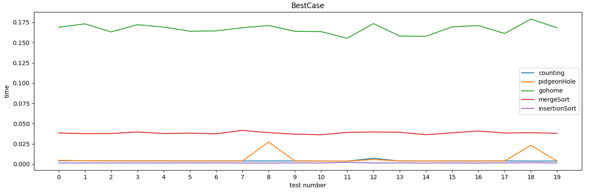
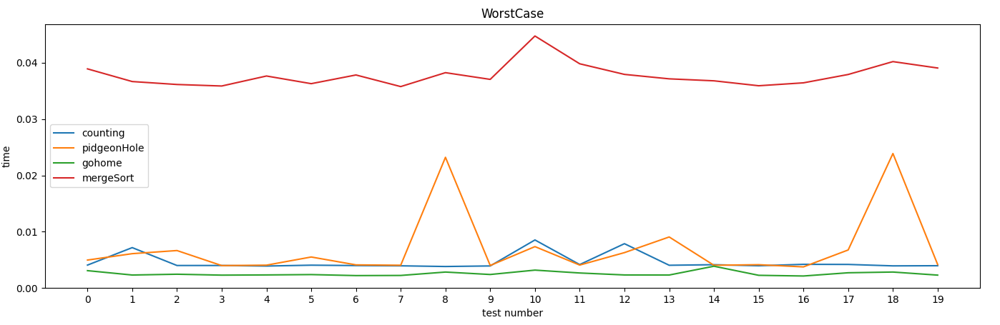
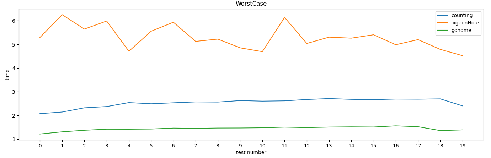
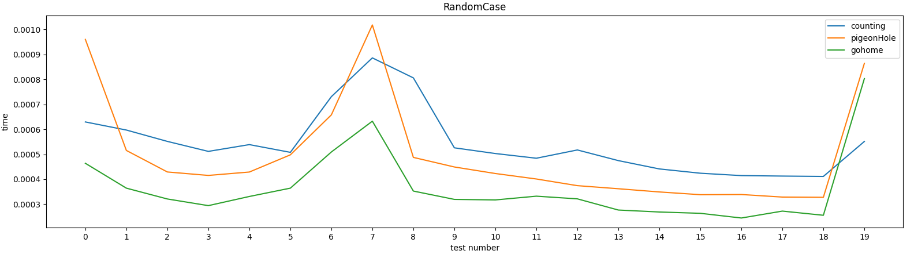
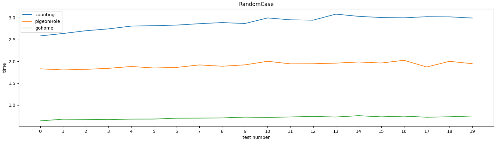
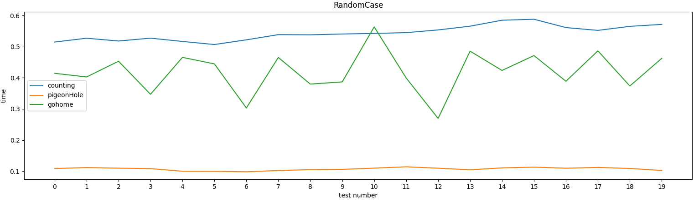
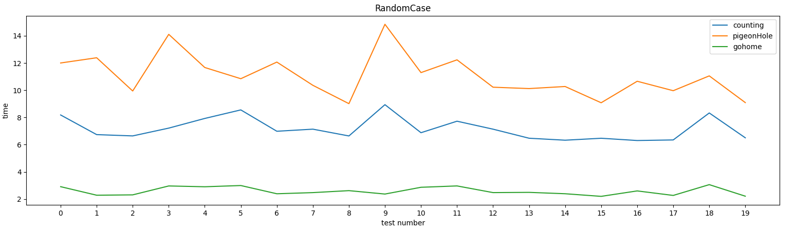

# :: GoHome ::

A (sometimes) faster Sorting Algorithm inspired by Pigeonhole Sort and Countin Sort, coded in Python 3.8.0.

### The Algorithm 

GoHome is inspired from Pigeonhole Sort and Counting Sort; essentially, it creates an “Oarr” (Ordering Array) and cycles the dataset using the values as index for counting the element: for example, if we have the current value equal to 5, then it will access Oarr[5] and sum one; if a number is outside the size of Oarr, a new array is created and merged with Oarr.
The final array will be built using Oarr, taking the index as final value and repeating it *“Oarr[index]”* times.

#### My tests are taken on 

```
OS_         Linux Mint 19.3
KERNEL_     5.0.0-32-generic

Python 3.8.0 (default, Dec  9 2021) [GCC 8.4.0] on linux

Architecture:        x86_64
CPU op-mode(s):      32-bit, 64-bit
Byte Order:          Little Endian
CPU(s):              8
On-line CPU(s) list: 0-7
Thread(s) per core:  2
Core(s) per socket:  4
Socket(s):           1
NUMA node(s):        1
Vendor ID:           GenuineIntel
CPU family:          6
Model:               142
Model name:          Intel(R) Core(TM) i7-10510U CPU @ 1.80GHz
Stepping:            12
CPU MHz:             2892.932
CPU max MHz:         4900,0000
CPU min MHz:         400,0000
BogoMIPS:            4608.00
Virtualization:      VT-x
L1d cache:           32K
L1i cache:           32K
L2 cache:            256K
L3 cache:            8192K
NUMA node0 CPU(s):   0-7
```

------------
### Best Case Scenario 
###### [ 0, 1, 2, …, N-1 ]


The GoHome algorithm is not suited for the so-called “Best Cases”, because the structure of the code performs poorly in this kind of situation and it shouldn't be used if the data source can provide such configuration; Thus, I’m not going to analyze the “Best Cases” furthermore.

> Algorithms: Counting Sort, Pigeonhole Sort, GoHome, Merge Sort, Insertion Sort;
Test config: 20 “Best Case” datasets, each one with a scale from 0 to 9999 


As we can see, GoHome, with an average speed of 0.1666 sec, is the slowest algorithm in this kind of scenario; Insertion Sort, with 0.0014 sec, is the fastest one: that’s ~100% faster. 

------------

### Worst Case Scenario 
###### [ N-1, …, 2, 1, 0 ]

#### Small Set

GoHome performs better than others algorithms: 
0.00253 average seconds against
0.00457 average seconds of Counting Sort (GH ~80% faster).
Merge Sort stands last with an average of 0.03783 seconds (GH  ~1400% faster).

> 
Algorithms: Counting Sort, Pigeonhole Sort, GoHome, Merge Sort;
Test config: 20 “Worst Case” datasets, each from 9999 to 0


#### Big Set

GoHome performs better than others algorithms: 
1.44360 average seconds against
5.29859 average seconds of Pigeonhole Sort (GH ~270% faster) and
2.53476 average seconds of Counting Sort (GH ~75% faster).

>
Algorithms: Counting Sort, Pigeonhole Sort, GoHome;
Test config: 20 “Worst Case” datasets, each from 4’999’999 to 0

------------
### Random Case Scenario
###### [ …, N-1, … ] 
#### Small Pool, Small Set

GoHome performs better than others algorithms: 
0.000365 average seconds against 
0.000498 average seconds of Pigeonhole Sort (GH ~35% faster) and 
0.000546 average seconds of Counting Sort (GH ~50% faster).

>  
 Algorithms: Counting Sort, Pigeonhole Sort, GoHome;
Test config: 20 “Random Case” datasets, each with 1000 random numbers from 0 to 999


#### Small Pool, Big Set
    
GoHome performs better than others algorithms: 
0.70897 average seconds against 
1.91365 average seconds of Pigeonhole Sort (GH ~170% faster) and 
2.89057 average seconds of Counting Sort (GH ~300% faster).

>  
 Algorithms: Counting Sort, Pigeonhole Sort, GoHome;
Test config: 20 “Random Case” datasets, each with 5’000’000 random numbers from 1 to 1000


#### Big Pool, Small Set

GoHome doesn’t performs better than others algorithms: 
0.41934 average seconds against
0.10736 average seconds of Pigeonhole Sort (GH ~75% slower) and 
0.54392 average seconds of Counting Sort (GH ~30% faster).

>
Algorithms: Counting Sort, Pigeonhole Sort, GoHome;
Test config: 20 “Random Case” datasets, each with 1000 random numbers from 1 to 5’000’000


#### Big Pool, Big Set

GoHome performs better than others algorithms: 
2.58956 average seconds against 
11.06322 average seconds of Pigeonhole Sort (GH ~330% faster) and 
7.17371 average seconds of Counting Sort (GH ~180% faster).

> Algorithms: Counting Sort, Pigeonhole Sort, GoHome;
Test config: 20 “Random Case” datasets, each with 5’000’000 random numbers from 1 to 5’000’000

------------

### Conclusions

In conclusion, GoHome is faster on all "Worst Cases" and "Random Cases" except for the "Big Pool, Small Set" scenario, in which the pool where the data is taken is more big than the set itself. In this cases gohome will suffer "holes" (None values) in the "Oarr"; more big is the pool in comparison to the set, more of these "holes" we will have, thus the algorithm will be more slow proportionally.

| Random Cases | Small Pool, Small Set | Small Pool, Big Set | Big Pool, Small Set |  Big Pool, Big Set  | 
| ------------ | ------------ | ------------ |  ------------ | ------------ |
| GoHome | Suited | Suited| Not Suited | Suited |  


#### Data recap


| Worst Cases   |   Small Set  | Big Set |
| ------------ | ------------ | ------------ |
| GoHome  |  0.00253 s | 1.4436 s  |
|  Pigeonhole Sort | Not analyzed  |   5.29859 s  |
|  Counting Sort |  0.00457 s  |   2.53476 s  |
|  Merge Sort |  0.03783 s   |  Not Analyzed |


| Random Cases | Small Pool, Small Set | Small Pool, Big Set | Big Pool, Small Set |  Big Pool, Big Set  | 
| ------------ | ------------ | ------------ |  ------------ | ------------ |
| GoHome | 0.000365 s | 0.70897 s | 0.41934 s | 2.58956 s |  
|  Pigeonhole Sort | 0.000498 s | 1.91365 s| 0.10736 s| 11.06322 s| 
| Counting Sort| 0.000546 s| 2.89057 s| 0.54392 s| 7.17371 s| 


